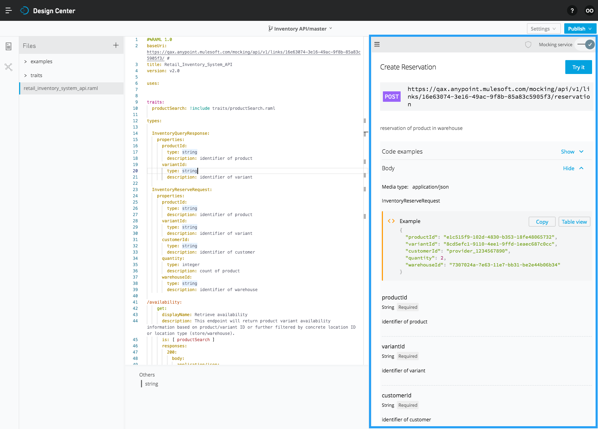

# Embedding API Console

Because API Console is build on top of web standards, it can be easily adapted
by any existing project or a web framework. An example of such interoperability
is use of the console in React project of MuleSoft's [API Designer](https://github.com/mulesoft/api-designer/).



In Design Center the API console is integrated seamlessly creating a unified
experience for working with API project.

## Getting started

Install the console in your project

```bash
npm i --save api-console
```

The next step depends on your setup. You may use framework like [Next.JS](https://nextjs.org/)
or [Angular](https://angular.io/) and how specifically you would include the element depends on this.

However, the console is a web custom element and just works like any other HTML tag.
In this example we will use plain HTML to describe the principle.

## In an HTML file

Embedding API console is two stage process: 1) import dependencies and 2) declare element use.

```html
<html>
  <head>
    <script type="module">
      import 'api-console/api-console.js';
    </script>
  </head>
  <body>
    <api-console></api-console>
  </body>
</html>
```

## Passing API data model

API Console uses data model generated from an API project using [AMF](https://github.com/aml-org/amf) parser.
The process of how to generate the model is described in details in [Parsing API Project](../advanced/parsing-amf.md)
document.

To make the console to render documentation you need to:

1.  Obtain AMF data model your the API project
2.  Pass the model as a JavaScript object to the console
3.  Update page selection

In an example implementation this could look like:

```html

<html>
  <head>
    ...
  </head>
  <body>
    <api-console></api-console>
    <script>
    (async () => {
      const model = await generateApiModel();
      const apic = document.querySelector('api-console');
      apic.amf = model;
      apic.selectedShape = 'summary';
      apic.selectedShapeType = 'summary';
    })();
    </script>
  </body>
</html>
```

The `selectedShape` and `selectedShapeType` tells the console to render default
page which is the API summary page.

## Required dependnecies

API Console uses few dependencies that are not included by default.
First reason for that is because your application can already cover some
functionality (OAuth 2 authorization for example) and there's no need to generate
duplicated code.
Other reason is that API Console uses few dependencies that are not ES modules ready.
Namely it is CodeMirror library.

### Code Mirror dependencies

Code mirror is not ES6 ready. Their build contains AMD exports which is
incompatible with native modules. Therefore the dependencies cannot be
imported with the element but outside of it. The component requires the following
scripts to be ready before it's initialized (especially body and headers editors):

```html
<script src="node_modules/jsonlint/lib/jsonlint.js"></script>
<script src="node_modules/codemirror/lib/codemirror.js"></script>
<script src="node_modules/codemirror/addon/mode/loadmode.js"></script>
<script src="node_modules/codemirror/mode/meta.js"></script>
<!-- Some basic syntax highlighting -->
<script src="node_modules/codemirror/mode/javascript/javascript.js"></script>
<script src="node_modules/codemirror/mode/xml/xml.js"></script>
<script src="node_modules/codemirror/mode/htmlmixed/htmlmixed.js"></script>
<script src="node_modules/codemirror/addon/lint/lint.js"></script>
<script src="node_modules/codemirror/addon/lint/json-lint.js"></script>
```

CodeMirror's modes location. May be skipped if all possible modes are already included into the app.

```html
<script>
CodeMirror.modeURL = 'node_modules/codemirror/mode/%N/%N.js';
</script>
```

### Dependencies for OAuth1 and Digest authorization methods

For the same reasons as for CodeMirror this dependencies are required
for OAuth1 and Digest authorization panels to work.

```html
<script src="node_modules/cryptojslib/components/core.js"></script>
<script src="node_modules/cryptojslib/rollups/sha1.js"></script>
<script src="node_modules/cryptojslib/components/enc-base64-min.js"></script>
<script src="node_modules/cryptojslib/rollups/md5.js"></script>
<script src="node_modules/cryptojslib/rollups/hmac-sha1.js"></script>
<script src="node_modules/jsrsasign/lib/jsrsasign-rsa-min.js"></script>
```

### OAuth 1/2 and HTTP requests factory dependencies

This section is coming very soon.

API Console as an embeddable custom element does not include sources for the components that handles OAuth2 authorization and making HTTP requests.

#### If your application does not handle authorization

Import the following libraries and declare them somewhere in the document.

Note: those libraries are already installed with `api-console`.

```html
<html>
  <head>
    <script type="module">
      import '@advanced-rest-client/oauth-authorization/oauth1-authorization.js';
      import '@advanced-rest-client/oauth-authorization/oauth2-authorization.js';
    </script>
  </head>
  <body>
    <oauth1-authorization></oauth1-authorization>
    <oauth2-authorization></oauth2-authorization>
  </body>
</html>
```

#### If your application does handle authorization

Refer to [Handling authorization events](../advanced/handling-events-in-component.md#oauth-token-exchange) documentation to learn about integrating API Console with your application.

### Making a HTTP request

API Console by itself does not make requests to the API. There's a number of reasons for that. CORS and code duplication is the most important reasons.
If your API is hosted on a different domain and CORS is not enabled for the documentation domain then you may want to handle requests by your own using some kind of proxy or other solutions.

#### If your application does not handle HTTP requests

Use `@advanced-rest-client/xhr-simple-request` component that works with API Console to make a HTTP request from the browser.

Note: this library is already installed with `api-console`.

```html
<html>
  <head>
    <script type="module">
      import '@advanced-rest-client/xhr-simple-request/xhr-simple-request.js';
    </script>
  </head>
  <body>
    <xhr-simple-request></xhr-simple-request>
  </body>
</html>
```

#### If your application does handle HTTP requests

Refer to [Handling requests events](../advanced/handling-events-in-component.md#request-events_1) documentation to learn about integrating API Console with your application.
